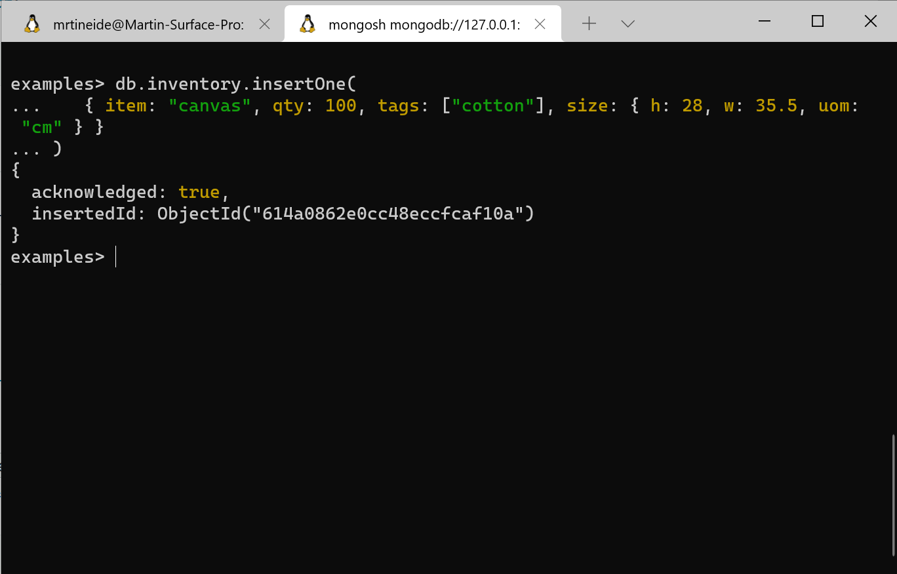

# Lab 3 - MongoDB

## Getting started
- Getting started was done as descibed, even though the bulletpoints in the assignment used different words to describe the 5 of the 6 tabs on the webiste at this current date. The assignment is probably written for a previous iteration of the same tutorial.


## Installation 
- The installation was done according to [this tutorial](https://docs.microsoft.com/en-us/windows/wsl/tutorials/wsl-database#install-mongodb). Verifying the package is done by the package manager, via the apt install command. 


## Experiment 1

Only 2 or fewer screenshots are given per CRUD operation  

### Inserting




### Query


### Update


### Remove

The items added to the collection and deleted:


Delete all that have status A:


### Bulk write
It is almost the same as the 2. image in [Write](/dat250-expass3.md#Write) section 


## Experiment 2

MapReduce's method is deprecated so aggregation pipeline was used instead.

Example from the tutorial:


The self developed pipeline aggregation operation:

```MongoDB
db.orders.aggregate([
{ $match: {ord_date: {$lt:ISODate("2020-03-23T00:00:00.000Z")}}},
{ $group: { _id: "$cust_id", value: { $sum: "$price" } } },
])
```

The idea was to filter orders that were made before the specified date.

As one can see, Don Quis order total was the one who had his sum reduced from 155 to 130, meaning that Don Quis had an order after the specified date. 
